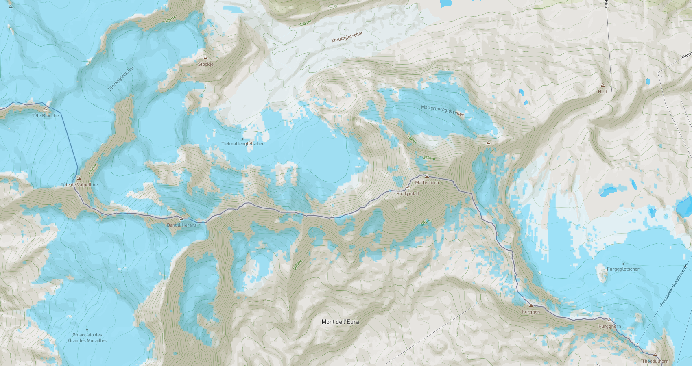

# DeFROST Overview

You can integrate snow cover data from DeFROST in two main ways:

### DeFROST Map Service

The Map Service allows you to **display the snow cover as a map** and integrates quickly with the most popular mobile & web mapping frameworks. This service implements the **Tiled Map Service** standard and allows you to customize the look and feel of the tiles on the fly. 



You can read through our [quickstart](introduction/development-quickstart.md) to get started with _**Leaflet**, **Mapbox**, **and OpenLayers**._

### DeFROST API

Do you want to power a custom, more advanced use case? [DeFROST API](https://defrost.ch/api-docs) lets you **query snow cover for a point, along a path or over an area programmatically**. Check below for a quick example on a query to find out whether or not there is snow at the top of the Matterhorn:



snow-point



Obtain the latest snow status data for a specific coordinate expressed in latitude and longitude degrees.






Latitude measured in degrees



Longitude measured in degrees







In this example, DeFROST returns a snow-positive reply for the Matterhorn summit last sensed by a satellite on 19th August 2019 at 12:15 UTC.


```javascript
{
    "lat": 45.9766,
    "lng": 7.6585, 
    "snow": true,
    "date": "2019-08-19T12:15:00Z",
}
```





The DeFROST API is a **RESTful API compliant with the OpenAPI 2.0** standard, so it can be integrated easily in your application.  As such you can use it in any environment connected to the world wide web using a TCP/IP library of your choice.  The **response data format is in the JSON format**, which is widely supported by all major programming languages and frameworks. That means you can integrate the API in most platforms including all major _**web browsers**, **Android**, **iOS**, **Python, C/C++, Node.js**_. You name it. 


To get started in minutes with either the Map Service or the API, read the [Development Quickstart](introduction/development-quickstart.md).


