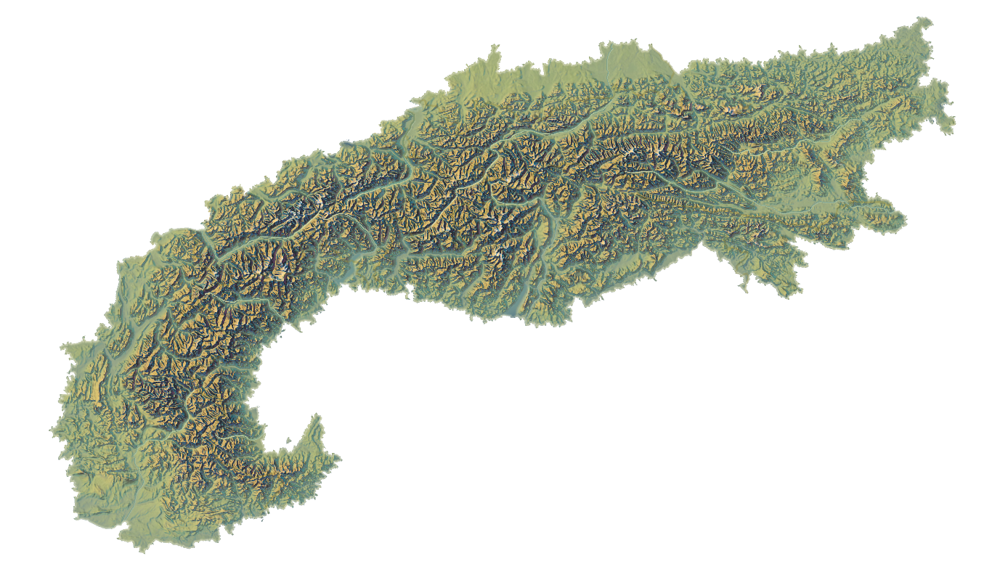

# European Alps Map

The Alps are the highest and most extensive mountain range system that lies entirely in Europe, and stretching approximately 1,200 kilometres across eight Alpine countries: France, Switzerland, Monaco, Italy, Liechtenstein, Austria, Germany, and Slovenia.



Due to the key importance of this area in Europe and globally in terms of population, visitors and human activity, DeFROST operates and serves a daily snow cover map with 20 meters resolution for its extent.


If you make any request for a tile outside the above covered area, the DeFROST server will return a 404 Not Found response code. 


### Map Characteristics

The table below summarizes this map's key characteristics: 

<table>
  <thead>
    <tr>
      <th style="text-align:left"><b>Map Characteristics</b>
      </th>
      <th style="text-align:left"></th>
    </tr>
  </thead>
  <tbody>
    <tr>
      <td style="text-align:left"><b>Spatial resolution</b>
      </td>
      <td style="text-align:left">20 meters</td>
    </tr>
    <tr>
      <td style="text-align:left"><b>Update time</b>
      </td>
      <td style="text-align:left">Daily at 3AM CET</td>
    </tr>
    <tr>
      <td style="text-align:left"><b>Tile zoom levels</b>
      </td>
      <td style="text-align:left">13 zoom levels</td>
    </tr>
    <tr>
      <td style="text-align:left"><b>Tile size</b>
      </td>
      <td style="text-align:left">256x256 pixels</td>
    </tr>
    <tr>
      <td style="text-align:left"><b>Default coloring</b>
      </td>
      <td style="text-align:left">
        <p>From light blue (#35e9e6) to bright pink (#ff01fb)</p>
        <p>The coloring spreads from 1cm to 2.5m+</p>
      </td>
    </tr>
    <tr>
      <td style="text-align:left"><b>Covered area</b>
      </td>
      <td style="text-align:left">Alpine Convention</td>
    </tr>
  </tbody>
</table>### Map Endpoint

To display the DeFROST European Alps snow cover map as a layer over the base map of your choice, use the URL string below as the Tile Server endpoint:

```http
https://maps.defrost.io/{z}/{x}/{y}.png
```

Pay attention to the fact that as any DeFROST endpoint, JWT Authentication is required for the Tile Server. This means **a valid JWT token has to be set in the HTTP Authorization request header**. Read more about Maps Authentication in the [Maps Overview section](maps-overview.md#maps-authentication-json-web-tokens). 

