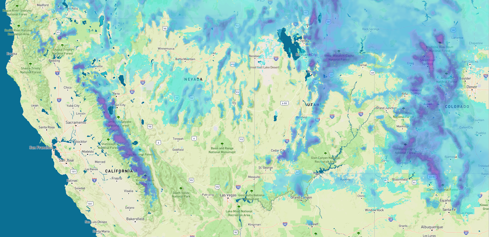

# Global Map

DeFROST operates and serves a **daily snow depth map** with 375 meters resolution for the entire world, excluding extreme latitudes \(i.e. the arctic and antarctic circles\).



Polar latitudes are mapped, but are subject to very low resolution and update frequency to seasonal perpetual darkness conditions in winter. Therefore, we currently do not recommend using the global map for latitudes above or below the 66.5° parallels south or north. 


### Map Characteristics

The table below summarizes this map's key characteristics: 

<table>
  <thead>
    <tr>
      <th style="text-align:left"><b>Map Characteristics</b>
      </th>
      <th style="text-align:left"></th>
    </tr>
  </thead>
  <tbody>
    <tr>
      <td style="text-align:left"><b>Spatial resolution</b>
      </td>
      <td style="text-align:left">375 meters</td>
    </tr>
    <tr>
      <td style="text-align:left"><b>Update time</b>
      </td>
      <td style="text-align:left">Daily at 4PM CET</td>
    </tr>
    <tr>
      <td style="text-align:left"><b>Tile zoom levels</b>
      </td>
      <td style="text-align:left">9 zoom levels</td>
    </tr>
    <tr>
      <td style="text-align:left"><b>Tile size</b>
      </td>
      <td style="text-align:left">256x256 pixels</td>
    </tr>
    <tr>
      <td style="text-align:left"><b>Default coloring</b>
      </td>
      <td style="text-align:left">
        <p>From light blue (#35e9e6) to bright pink (#ff01fb)</p>
        <p>The coloring spreads from 1cm to 2.5m+</p>
      </td>
    </tr>
    <tr>
      <td style="text-align:left"><b>Covered area</b>
      </td>
      <td style="text-align:left">66.5&#xB0;N to 66.5&#xB0;S</td>
    </tr>
  </tbody>
</table>To illustrate varying snow depths in the global map, the following coloring schema is applied:


### Map Endpoint

To display the DeFROST Global snow depth map as a layer over the basemap of your choice, use the URL string below as the Tile Server endpoint:

```http
https://maps.defrost.io/global/v1/{z}/{x}/{y}.png
```

Pay attention to the fact that as any DeFROST endpoint, JWT Authentication is required for the Tile Server. This means **a valid JWT token has to be set in the HTTP Authorization request header**. Read more about Maps Authentication in the [Maps Overview section](maps-overview.md#maps-authentication-json-web-tokens). 

