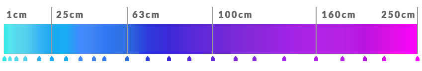

# Maps Overview

DeFROST currently offers **two different snow maps**: one covering the [European Alps](european-alps-map.md) and the other  covering [the entire globe](global-map.md). Both maps display the snow depth in centimeters.

The table below quickly summarizes both maps' main characteristics:

|  | \*\*\*\*[**European Alps Map**](european-alps-map.md) | \*\*\*\*[**Global Map**](global-map.md) |
| :--- | :--- | :--- |
| **Spatial resolution** | 20 meters | 375 meters |
| **Update time** | Daily at 3AM CET | Daily at 4PM CET |
| **Tile zoom levels** | 13 zoom levels | 9 zoom levels |
| **Tile size** | 256x256 pixels | 256x256 pixels |
| **Snow depth color range** | Light blue \(\#35e9e6\) to Bright pink \(\#ff01fb\) | Light blue \(\#35e9e6\) to Bright pink \(\#ff01fb\) |
| **Covered area** | Alpine Convention | 66.5°N to 66.5°S |

Both maps are **served via their own** [**Tile Map Service**](https://wiki.openstreetmap.org/wiki/Slippy_map_tilenames) **\(TMS\) based XYZ tiles endpoint**, making it easy to display it as a layer on top of a basemap of choice, with any of the major web mapping libraries available today such as OpenLayers, Leaflet or Mapbox. 

### Map Legend

You can use the image below in your application so your users can interpret the snow depth seen on the map. Or feel free to use the JSON definition to programmatically display the range.



### Maps Authentication: JSON Web Tokens

In the same way as the DeFROST API, access to the Maps is protected using the [JSON Web Tokens \(JWT\)](https://jwt.io/) industry standard. This means that **any request to the XYZ tile endpoints must be authenticated by passing a valid JWT token in the HTTP Authorization request header**.


Check the [Obtain your API tokens section](../introduction/development-quickstart.md#step-1-obtain-your-api-tokens) in the Development Quickstart for important details on DeFROST's Authentication functioning, applying to both the API and Maps.


JWT is a highly secure, modern but relatively recent way of securing the access to a Tile Server, making it neccessary to write additional code in order to make it work with some web mapping libraries such as OpenLayers or Leaflet. The Mapbox library already supports JWT authentication method easily out of the box. However - **we have already made that work for you**:


You can **check working code examples** on either OpenLayers, Leaflet or Mapbox in the [Development Quickstart](../introduction/development-quickstart.md) section or the [example project](https://github.com/wegaw/defrost-examples).


